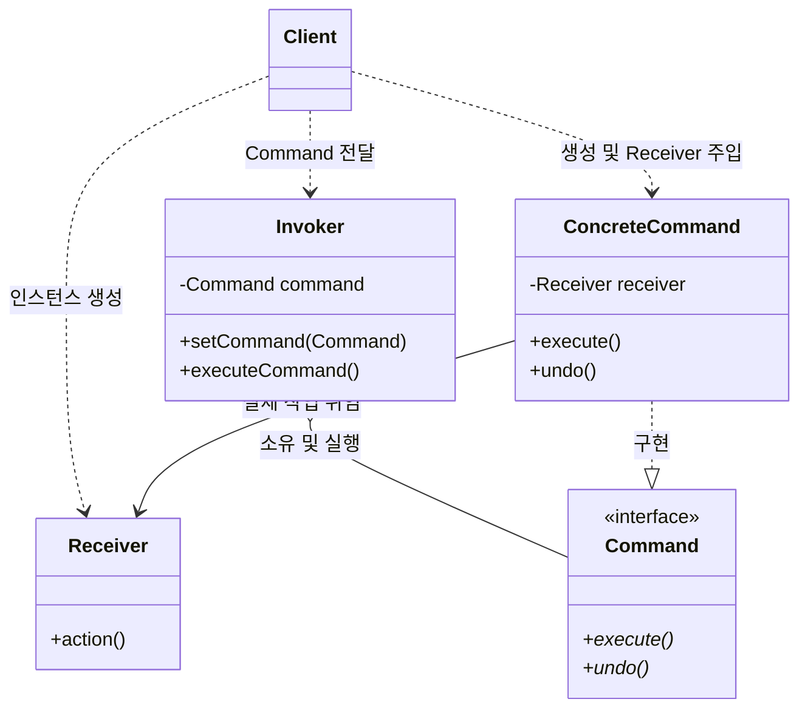
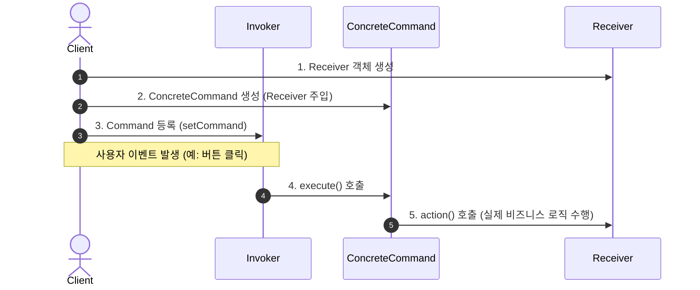

# 📄 커맨드 패턴 (Command Pattern) 완벽 가이드

> **"요청(Request) 자체를 독립된 객체로 캡슐화하여, 요청의 매개변수화, 작업 대기열 저장, 로깅, 실행 취소(Undo)를 가능하게 하는 행동 디자인 패턴"**

---

## 📌 핵심 요약

| 항목 | 내용 |
| :--- | :--- |
| **패턴 분류** | 행동 패턴 (Behavioral Pattern) |
| **다른 이름** | Action, Transaction |
| **핵심 목적** | 요청 발송자(**Invoker**)와 실제 로직 수행자(**Receiver**) 간의 **완벽한 결합도 해제(Decoupling)** |
| **주요 키워드** | `#캡슐화` `#Undo/Redo` `#작업큐` `#SRP/OCP` |

---

## 1. 개요 (Overview)

커맨드 패턴은 **"어떤 작업을 실행해 줘"**라는 요청을 객체의 형태로 포장(캡슐화)합니다.  
요청을 객체로 만들면 다음과 같은 강력한 이점을 얻을 수 있습니다:

- **매개변수화:** 서로 다른 커맨드를 함수 인자로 전달하거나 객체에 저장할 수 있습니다.
- **큐/스케줄링:** 작업 요청을 대기열(Queue)에 넣고 나중에 실행하거나 백그라운드에서 처리할 수 있습니다.
- **실행 취소(Undo) & 다시 실행(Redo):** 커맨드가 실행되기 전 상태를 저장하여 작업을 역으로 취소할 수 있습니다.

---

## 2. 구성 요소 (Components)

| 구성 요소 | 역할 및 설명 | 식당 비유 매칭 |
| :--- | :--- | :--- |
| **Command**<br>*(인터페이스/추상 클래스)* | 실행할 작업의 공통 인터페이스 선언 (`execute()`, `undo()`) | **주문서 양식** |
| **ConcreteCommand**<br>*(구상 커맨드)* | `Command`를 구현하며, 실제 작업을 수행할 `Receiver` 객체와 매개변수를 바인딩 | **작성된 특정 주문서**<br>*(예: 스테이크 주문서)* |
| **Receiver**<br>*(수신자)* | 실제 비즈니스 로직 및 행동을 수행하는 대상 객체 | **요리사** |
| **Invoker**<br>*(발송자/호출자)* | 커맨드 객체를 보유하고 실행 요청을 보냄 (UI 버튼, 키 매니저 등) | **웨이터 / 키오스크** |
| **Client**<br>*(클라이언트)* | `ConcreteCommand` 객체를 생성하고 `Receiver` 및 `Invoker`를 조립 및 연결 | **손님** |

---

## 3. 구조 및 흐름 (Structure & Flow)

### 🏗️ 클래스 다이어그램 (UML)



### 🔄 실행 시 호출 순서 (Sequence Flow)



---

## 4. 코드 예시 (Java)

### ❌ 패턴 미적용 예시 (강한 결합)

스위치(`Switch`)가 전등(`Light`) 클래스에 직접 의존하여 확장성이 크게 떨어지는 구조입니다.

```java
// Receiver (수신자)
class Light {
    public void turnOn() {
        System.out.println("💡 불이 켜졌습니다.");
    }
}

// Invoker (발송자/호출자)
class Switch {
    private Light light; // 전등에 직접 결합됨

    public Switch(Light light) {
        this.light = light;
    }

    public void press() {
        // 스위치로 TV나 선풍기를 켜려면 Switch 코드 자체를 수정해야 함!
        this.light.turnOn();
    }
}
```

---

### 💡 커맨드 패턴 적용 예시

`Command` 인터페이스를 도입하여 `Switch`와 `Light` 사이의 결합을 분리합니다.

```java
// 1. Command 인터페이스
interface Command {
    void execute();
    void undo();
}

// 2. Receiver (수신자)
class Light {
    public void turnOn() { System.out.println("💡 불이 켜졌습니다."); }
    public void turnOff() { System.out.println("🔌 불이 꺼졌습니다."); }
}

class Stereo {
    public void turnOn() { System.out.println("🎵 오디오가 켜집니다."); }
    public void turnOff() { System.out.println("🔇 오디오가 꺼집니다."); }
}

// 3. ConcreteCommand (구상 커맨드)
class LightOnCommand implements Command {
    private final Light light;

    public LightOnCommand(Light light) {
        this.light = light;
    }

    @Override
    public void execute() { light.turnOn(); }

    @Override
    public void undo() { light.turnOff(); }
}

class StereoOnCommand implements Command {
    private final Stereo stereo;

    public StereoOnCommand(Stereo stereo) {
        this.stereo = stereo;
    }

    @Override
    public void execute() { stereo.turnOn(); }

    @Override
    public void undo() { stereo.turnOff(); }
}

// 4. Invoker (발송자/호출자)
class Switch {
    private Command command;

    public void setCommand(Command command) {
        this.command = command;
    }

    public void press() {
        if (command != null) {
            command.execute();
        }
    }

    public void pressUndo() {
        if (command != null) {
            command.undo();
        }
    }
}

// 5. Client (사용)
public class Main {
    public static void main(String[] args) {
        Light light = new Light();
        Command lightOn = new LightOnCommand(light);

        Switch remote = new Switch();
        remote.setCommand(lightOn);

        remote.press();     // 💡 불이 켜졌습니다.
        remote.pressUndo(); // 🔌 불이 꺼졌습니다.

        // 스위치 코드를 수정하지 않고 새로운 기기(Stereo) 연결 가능!
        Stereo stereo = new Stereo();
        remote.setCommand(new StereoOnCommand(stereo));
        remote.press();     // 🎵 오디오가 켜집니다.
    }
}
```

---

### 🚀 응용: Spring 서버에서의 보상 트랜잭션 (Compensating Transaction) 및 Undo/Rollback

프론트엔드의 화면 단위 Ctrl+Z와 달리, **Spring 백엔드 서버**에서는 MSA 분산 환경이나 복합 비즈니스 파이프라인에서 실패 발생 시 **보상 트랜잭션(Compensating Transaction / Saga Pattern)**을 수행할 때 커맨드 패턴의 `undo()` 개념을 핵심으로 활용합니다.

```java
import org.springframework.stereotype.Component;
import org.springframework.stereotype.Service;
import lombok.RequiredArgsConstructor;
import java.util.ArrayDeque;
import java.util.Deque;
import java.util.List;

// 1. Command 인터페이스 (보상 트랜잭션 포함)
public interface Command {
    void execute();
    void undo(); // 보상 트랜잭션 (실패 시 복구 로직)
}

// 2. ConcreteCommand - 재고 차감 커맨드
@Service
@RequiredArgsConstructor
class ReserveStockCommand implements Command {
    private final StockService stockService;
    private final Long productId;
    private final int quantity;

    @Override
    public void execute() {
        stockService.deductStock(productId, quantity);
    }

    @Override
    public void undo() {
        stockService.restoreStock(productId, quantity); // 보상: 재고 복구
    }
}

// 3. ConcreteCommand - 결제 처리 커맨드
@Service
@RequiredArgsConstructor
class ProcessPaymentCommand implements Command {
    private final PaymentService paymentService;
    private final Long orderId;
    private final int amount;

    @Override
    public void execute() {
        paymentService.pay(orderId, amount);
    }

    @Override
    public void undo() {
        paymentService.refund(orderId, amount); // 보상: 결제 환불
    }
}

// 4. Invoker - Spring 관리형 파이프라인 트랜잭션 매니저
@Component
public class TransactionCommandExecutor {

    public void executePipeline(List<Command> pipeline) {
        Deque<Command> executedCommands = new ArrayDeque<>();

        try {
            for (Command command : pipeline) {
                command.execute();
                executedCommands.push(command); // 성공한 커맨드 스택 적재
            }
        } catch (Exception e) {
            System.err.println("❌ 파이프라인 실행 중 예외 발생! 역순 보상 트랜잭션(Undo) 시작: " + e.getMessage());
            rollbackPipeline(executedCommands);
            throw e;
        }
    }

    private void rollbackPipeline(Deque<Command> executedCommands) {
        while (!executedCommands.isEmpty()) {
            Command command = executedCommands.pop();
            try {
                command.undo(); // 역순 보상 실행 (재고 복구 -> 결제 환불 등)
            } catch (Exception undoEx) {
                System.err.println("⚠️ 보상 트랜잭션 실패 (별도 딜레이드 큐 기록 필요): " + undoEx.getMessage());
            }
        }
    }
}
```

---

## 5. 실무 활용 사례

1. **Spring Web MVC의 Request DTO & DispatcherServlet**
   - Spring MVC 공식 문서에서도 HTTP 요청 파라미터를 바인딩하는 DTO 객체를 공식적으로 **Command Object(커맨드 객체)**라 부릅니다.
   - 요청 데이터를 `Request DTO`로 캡슐화하여 `DispatcherServlet`(Invoker)이 적절한 `Controller / Service`(Receiver)로 전달하는 아키텍처 구조를 사용합니다.
2. **에디터 / IDE의 Undo & Redo (실행 취소/다시 실행)**
   - 포토샵, VS Code, 워드 등에서 작업(텍스트 입력, 도형 생성, 삭제 등)을 `Command` 객체로 생성해 스택(Stack)에 적재한 후 실행 취소 시 역순으로 `undo()` 수행.
3. **비동기 작업 큐 및 대기열 (Task / Job Queue)**
   - 이메일 발송, PDF 리포트 생성, 외부 PG 결제 승인 요청을 `Command` 객체(DTO 직렬화)로 큐(Kafka, RabbitMQ)에 적재 후, 백그라운드 Worker 프로세스가 순차 처리.
4. **게임 입력 매핑 및 매크로 작업 (Input Rebinding & MacroCommand)**
   - 키 바인딩 변경 기능 (예: `Space` 키 -> [점프] 또는 [공격]) 및 여러 명령을 묶어 일괄 실행하는 복합 작업.

---

## 6. 장점과 단점 (Pros & Cons)

### 👍 장점
- **단일 책임 원칙 (SRP):** 비즈니스 실행 요청(Invoker/Queue)과 실제 도메인 서비스 로직(Receiver)이 철저히 분리됩니다.
- **개방-폐쇄 원칙 (OCP):** 기존 컨트롤러나 파이프라인 코드를 수정하지 않고 새로운 비즈니스 커맨드를 추가할 수 있습니다.
- **분산 환경 보상 트랜잭션 구현:** Saga 패턴 등 분산 트랜잭션 환경에서 역작업(보상 트랜잭션) 정의가 명확해집니다.
- **작업 대기열 및 스케줄링 용이:** 요청 객체 자체가 캡슐화되어 메세지 큐(Kafka, RabbitMQ)나 스케줄러에 저장 후 지연 실행이 가능합니다.

### 👎 단점
- **클래스 및 보상 로직 관리 부담:** 비즈니스 작업(Action)마다 `ConcreteCommand` 클래스와 `undo()` (보상 로직)를 작성해야 하므로 코드베이스가 커질 수 있습니다. *(Spring에서는 람다 표현식이나 `@EventListener` 기반 이벤트 캡슐화로 완화 가능)*

---

## 7. 다른 패턴들과의 비교

| 패턴 | 핵심 목적 | 커맨드 패턴과의 차이점 (Spring 백엔드 기준) |
| :--- | :--- | :--- |
| **커맨드 (Command)** | **"무엇을(Action)"** 실행할 것인가 캡슐화 | 요청을 객체화하여 결합 해제, **보상 트랜잭션(Saga)/비동기 큐**에 초점 |
| **전략 (Strategy)** | **"어떻게(Algorithm)"** 수행할 것인가 교체 | 동일 목적의 **비즈니스 알고리즘 교체**에 초점 (결제 수단별 계산 방식 등) |
| **책임 연쇄 (CoR)** | **"누가(Handler)"** 처리할 것인가 결정 | Spring Security 필터 체인처럼 요청이 적절한 처리자를 만날 때까지 전달 |
| **메멘토 (Memento)** | **"상태를 어떻게 복원할 것인가"** | 커맨드가 `undo()` 수행 시 **객체의 이전 스냅샷 상태를 복원**하기 위해 함께 사용 |

---

## 💡 판단 기준: 언제 커맨드 패턴을 써야 할까? (Spring 서버 개발)

- [x] **MSA 분산 환경**에서 `@Transactional` 롤백 대신 **보상 트랜잭션(Compensating Transaction)** 체인이 필요할 때
- [x] **CQRS 아키텍처**를 도입하여 생성/수정/삭제 요청(Command)과 조회(Query) 흐름을 분리할 때
- [x] 요청을 즉시 처리하지 않고 **Message Queue (Kafka, RabbitMQ)**에 적재해 비동기/순차 실행할 때
- [x] 모든 비즈니스 요청의 **실행 이력, 파라미터, 결과를 DB에 감사 로그(Audit Log)로 남겨야 할 때**
- [x] 백엔드 파이프라인의 각 단계를 커맨드로 포장하여 **단계별 실패 시 선택적 복구/재시도**를 구현할 때

---

## 8. 🔍 심화: Spring 백엔드 아키텍처와 커맨드 패턴

> **"Spring 아키텍처, CQRS, MSA 분산 환경에서 커맨드 패턴이 활용되는 방식과 클래식 패턴과의 비교"**

### 🤝 1. 커맨드 패턴과 Spring MVC 구성 요소 매핑

| 커맨드 패턴 구성 요소 | Spring MVC 구조 | 역할 |
| :--- | :--- | :--- |
| **Command (요청 객체)** | **Request DTO / HttpServletRequest** | HTTP 파라미터, 헤더, 바디 데이터를 **독립된 객체로 포장(캡슐화)** |
| **Invoker (발송자)** | **DispatcherServlet / HandlerAdapter** | HTTP 요청을 분석하여 적절한 처리자(Controller/Service)로 **전달 및 위임** |
| **Receiver (수신자)** | **Controller / Service / Repository** | 실제로 요청된 비즈니스 로직 및 DB 처리를 수행 |
| **Client (클라이언트)** | **웹 브라우저 / API 클라이언트** | HTTP 요청(Command)을 생성하여 서버로 전달 |

---

### 🏗️ 2. 고급 백엔드 아키텍처 활용 사례

1. **MSA 및 분산 트랜잭션의 보상 트랜잭션 (Saga Pattern)**
   - 마이크로서비스 환경에서 DB가 분리되어 `@Transactional` 하나로 전체 롤백이 불가능할 때, 각 서비스 호출(결제, 재고, 쿠폰)을 `Command`로 포장하고 실패 시 역순으로 `undo()` (보상 트랜잭션)를 실행하여 **결과적 일관성(Eventual Consistency)** 보장.
2. **CQRS 아키텍처 (Command Query Responsibility Segregation)**
   - CUD(생성/수정/삭제) 작업 요청을 `CreateOrderCommand`, `UpdateUserCommand` 형태의 커맨드 객체로 캡슐화하고 `CommandBus` / `CommandGateway`를 통해 비즈니스 핸들러(CommandHandler)로 라우팅.
3. **감사 로그 (Audit Log) 및 이력 추적**
   - 어드민 시스템이나 결제/금융 서버에서 "누가, 언제, 어떤 매개변수로 무슨 변경 명령(Command)을 실행했는지"를 DB/Redis에 직렬화하여 저장하고 추적 및 재실행(Replay) 기능 제공.
4. **Spring Batch / 데이터 처리 파이프라인**
   - 여러 단계의 ETL, 데이터 가공 절차를 독립적인 커맨드 항목으로 구성하여 특정 단계 실패 시 해당 단계부터 재시도하거나 롤백 처리.

---

### ⚖️ 3. 클래식 GoF 패턴 vs Modern Spring / CQRS 아키텍처

- **GoF 커맨드 패턴 (행동 + 데이터 통합)**:
  `command.execute()` 형태로 커맨드 객체 내부에서 데이터와 실행 로직을 함께 가집니다.
- **Spring Request DTO (행동과 데이터의 분리)**:
  Request 객체는 순수 데이터만 가진 **DTO(Data Transfer Object)**이며, 실행 로직은 별도의 **Service / `CommandHandler`**에 위임됩니다.

> **💡 결론:** Request 객체에 `execute()` 메서드가 직접 들어있지 않더라도, **"요청을 객체로 포장하여 송신자와 수신자를 분리하고 프론트 컨트롤러(DispatcherServlet)가 이를 위임 처리한다"**는 본질적 구조와 철학은 **커맨드 패턴의 핵심**을 그대로 계승하고 있습니다.

---

## 📚 참고자료 (References)
- [Refactoring Guru - 커맨드 패턴](https://refactoring.guru/ko/design-patterns/command)
- *Design Patterns: Elements of Reusable Object-Oriented Software* (GoF)


